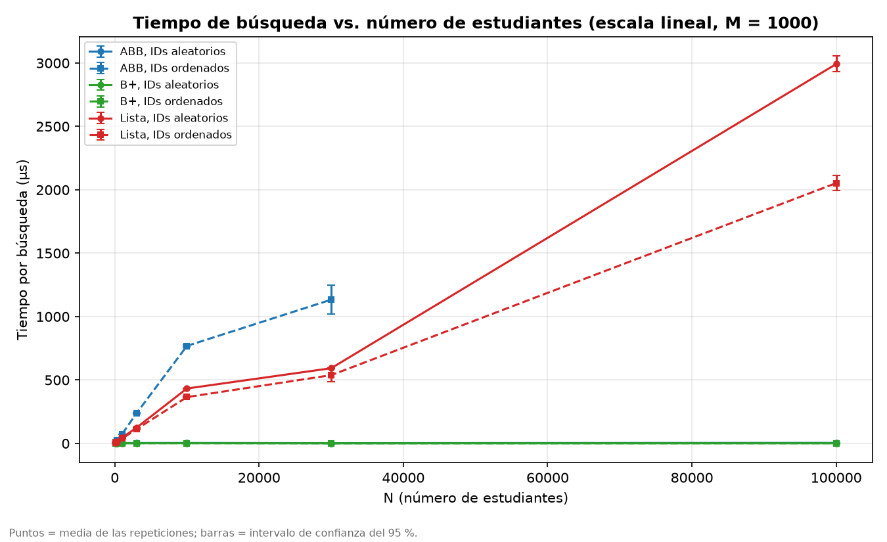
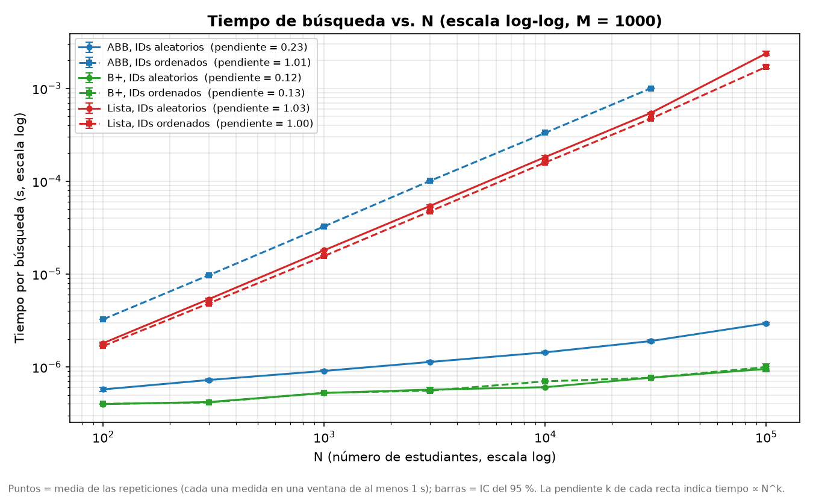
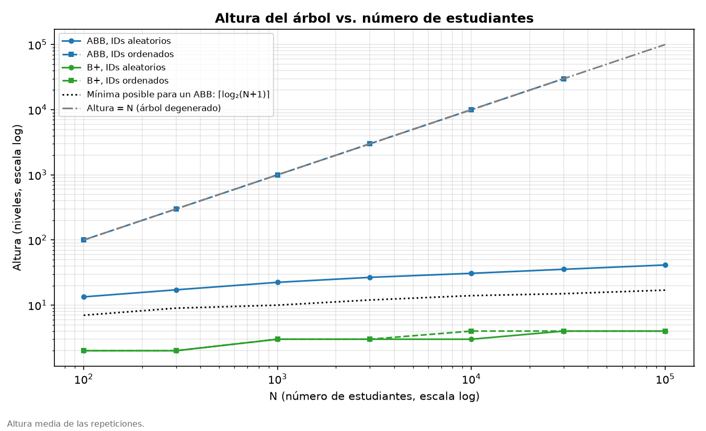
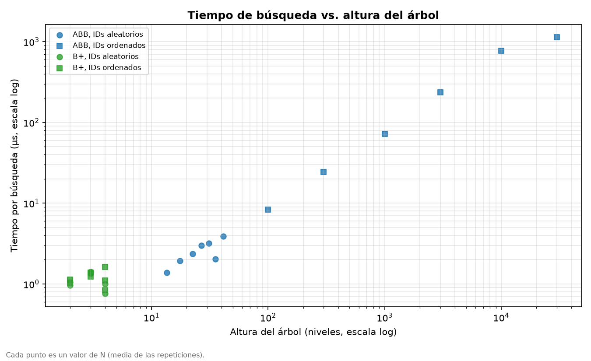
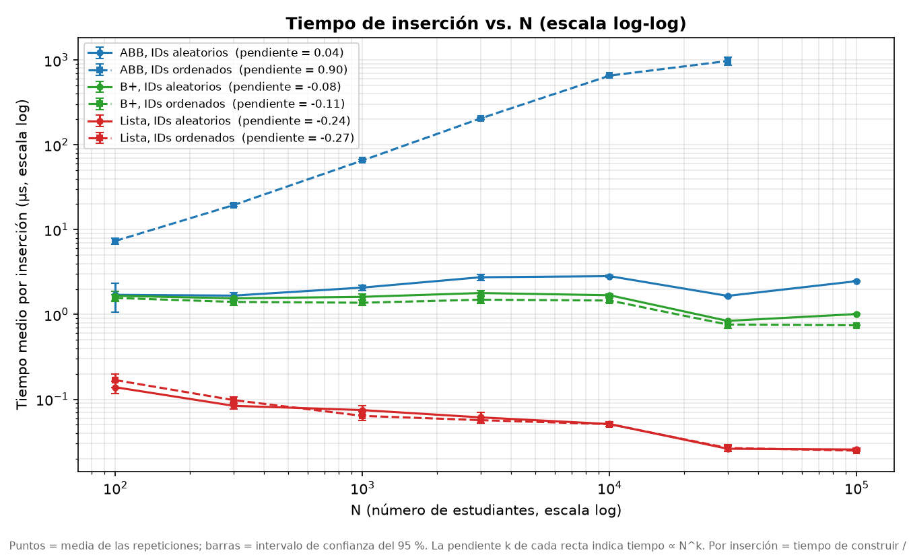
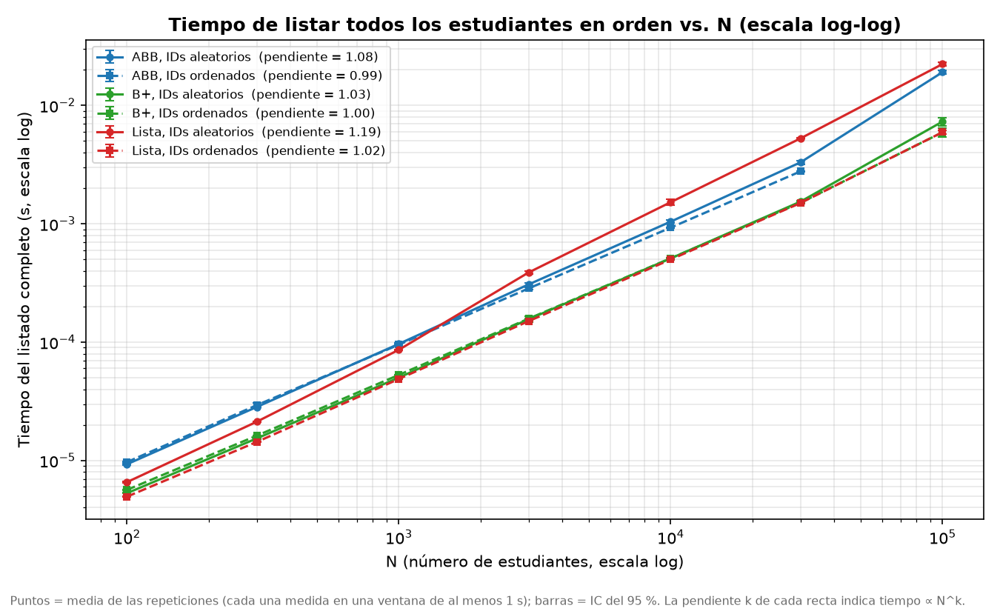
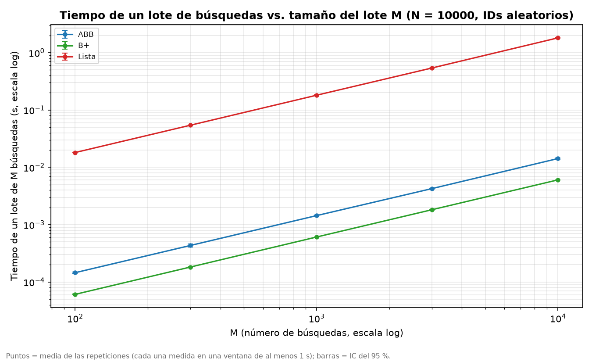

# Laboratorio 3 — Sistema de búsqueda de estudiantes: Lista vs ABB vs Árbol B+

**Integrantes:** <Jesica Alejandra Estor Soto – 1082890547>

---

## 1. Problema y objetivo

Una institución necesita un sistema que permita **buscar** un estudiante por ID,
**insertar** estudiantes y **listar** todos los estudiantes en orden de ID. Cada estudiante tiene
ID (matrícula), nombre, edad y promedio.

**Objetivo:** estudiar experimentalmente cómo el tiempo de esas tres operaciones **escala al
aumentar el número de estudiantes N** en tres estructuras de datos (lista, árbol binario de
búsqueda y árbol B+), con dos órdenes de inserción (IDs ordenados y aleatorios), y comparar los
resultados con la complejidad teórica usando análisis estadístico. También nos interesa
identificar **dónde la realidad se aparta de la teoría** y por qué.

## 2. Contenido del repositorio

| Archivo | Qué contiene |
|---|---|
| `lista.py` | Generación de estudiantes (`generar_estudiantes(n, orden, semilla)`) y sistema con lista. |
| `ABB.py` | Árbol binario de búsqueda (inserción, búsqueda, recorrido inorden y altura, todos iterativos). |
| `arbolbplus.py` | Árbol B+ (inserción con división de nodos, búsqueda, eliminación, recorrido por hojas enlazadas). |
| `implementacion.py` | Menú interactivo del sistema usando el árbol B+. |
| `experimento.py` | Corre los experimentos y guarda cada medición en `resultados/mediciones.csv`. |
| `analisis.py` | Calcula las estadísticas y genera `resultados/resumen.md`. |
| `graficas.py` | Genera las gráficas en `graficas/` a partir de los resultados guardados. |
| `resultados/` | Mediciones crudas, estadísticas, pendientes, resumen y descripción del entorno. |
| `graficas/` | Las 9 gráficas del informe. |
| `CODIGO_DE_HONOR.md` | Código de honor y declaración de uso de IA. |

## 3. Cómo reproducir los experimentos

```bash
pip install -r requirements.txt          # en Windows: py -m pip install -r requirements.txt

python experimento.py --rapido   # prueba de ~1 minuto (se guarda en resultados_prueba/)
python experimento.py            # experimento completo (~55 minutos)
python analisis.py               # estadísticas -> resultados/resumen.md
python graficas.py               # gráficas -> graficas/
```

Las gráficas y estadísticas se pueden regenerar sin repetir el experimento, porque
`analisis.py` y `graficas.py` solo leen `resultados/mediciones.csv`.

Para probar el sistema interactivo: `python implementacion.py`.

## 4. Metodología

### 4.1 Estructuras y complejidad teórica

| Estructura | Insertar (uno) | Buscar | Listar en orden | Altura |
|---|---|---|---|---|
| Lista | O(1) (`append`) | O(N) | O(N log N) (ordenar); O(N) si ya está ordenada | — |
| ABB, IDs aleatorios | O(log N) promedio | O(log N) promedio | O(N) (inorden) | ≈ c·log N |
| ABB, IDs ordenados | O(N) | O(N) | O(N) | N (degenerado) |
| Árbol B+ (orden 32) | O(log N) | O(log N) | O(N) (hojas enlazadas) | ≈ log₃₂ N |

### 4.2 Hardware y software

Ver `resultados/entorno.txt` (lo genera `experimento.py` automáticamente).

- **Procesador:** AMD Ryzen serie 5000 para portátiles (AMD64 Family 25 Model 80), 16 núcleos lógicos. <Completar modelo exacto: Administrador de tareas → Rendimiento → CPU>
- **RAM:** 16 GB
- **Sistema operativo:** Windows 11 (compilación 26200)
- **Python:** 3.13.7 (CPython); librerías: numpy, pandas, scipy, matplotlib.
- **Reloj:** `time.perf_counter()`, que en Windows usa `QueryPerformanceCounter`, con resolución de 100 ns (10⁻⁷ s).
- **Condiciones:** portátil conectado a la corriente, modo de energía "Mejor rendimiento",
  sincronización de OneDrive pausada, sin otros programas abiertos durante la medición.
  <Ajustar si algo fue distinto>

### 4.3 Parámetros

| Parámetro | Valores | Justificación |
|---|---|---|
| N (estudiantes), experimento A | 100, 300, 1 000, 3 000, 10 000, 30 000, 100 000 | Crecen ~×3: quedan espaciados de forma pareja en escala log y cubren desde N pequeño (dominan costos constantes) hasta N grande (domina la complejidad). |
| M (búsquedas por lote), experimento A | 1 000 | Se buscan lotes de 1 000 IDs; se reporta el tiempo **por búsqueda**. |
| M, experimento B | 100, 300, 1 000, 3 000, 10 000 con N = 10 000 | Estudiar M como parámetro. |
| Orden de inserción | ordenado, aleatorio | Sugerencia del enunciado; afecta mucho al ABB. |
| Repeticiones | 20 por combinación | Cada medición ya promedia miles de operaciones durante ≥ 1 s, así que su ruido propio es bajo; 20 repeticiones con datos distintos dan intervalos de confianza estrechos y mantienen la duración total en ~55 minutos. |
| Ventana mínima de medición | 1 segundo | Guías de benchmarking (ver 4.7). |
| Orden del árbol B+ | 32 (hasta 31 claves por nodo) | Valor intermedio típico. |
| Límite del ABB ordenado | N ≤ 30 000 | Construirlo es O(N²): una sola construcción con N = 100 000 tardaría ~5 minutos (ver 4.7). |

### 4.4 Generación de los datos

`generar_estudiantes(n, orden, semilla)` crea los IDs 1..N. En el caso **aleatorio** son
**los mismos IDs revueltos** (una permutación). Así, entre ambos casos solo cambia el orden de
inserción. Nombre (de una lista fija de 30), edad (16–30) y promedio (0–10) se generan al azar.
La semilla de cada repetición es su número, lo que hace el experimento reproducible.

### 4.5 Generación de las búsquedas

Las búsquedas se hacen en **lotes de M IDs** elegidos al azar entre 1 y N **con reemplazo**
(permite M > N). Cada lote usa **IDs nuevos**, generados antes de empezar a cronometrar. Con la
misma semilla, **las tres estructuras buscan exactamente la misma secuencia de IDs**. Todos los IDs
buscados existen.

### 4.6 Medición de tiempos

- Reloj: `time.perf_counter()`. El recolector de basura de Python se desactiva durante cada medición.
- **Cada medición dura al menos 1 segundo.** La operación (construir la estructura, un lote de
  búsquedas o un listado) se ejecuta una vez para calibrar cuánto tarda; esa ejecución se
  descarta (sirve de calentamiento), salvo que ya dure 1 s o más. Luego se repite las veces
  necesarias para llenar la ventana, y se divide el tiempo total por el número de repeticiones.
  - Construir: cada repetición construye la estructura desde cero.
  - Buscar: cada repetición es un lote con IDs nuevos, para no reutilizar siempre los mismos
    caminos del árbol (quedarían en la caché del procesador y el tiempo saldría optimista).
  - Listar: cada repetición genera el listado completo de nuevo.
- **Orden aleatorio de las configuraciones:** en cada repetición, las 14 combinaciones
  (N, orden de inserción) se recorren en orden aleatorio, y también el orden de las tres
  estructuras. Así, un cambio de velocidad del computador afecta a todos los N por igual y no se
  confunde con el efecto de N (ver sección 5).
- Cada medición guarda su momento (minutos desde el inicio) y la duración real de su ventana.
- Comprobación de correctitud: se encuentran todos los IDs buscados y el listado sale
  1, 2, ..., N. Si no, el experimento se detiene.

### 4.7 Duración de las mediciones y guías de benchmarking

**Por qué los resultados están en nanosegundos o microsegundos.** La pregunta del laboratorio es
cómo crece el costo de **una** operación (una búsqueda, una inserción) con N, porque eso es lo que
predice la complejidad teórica (O(N), O(log N)). Una búsqueda en un árbol B+ cuesta menos de un
microsegundo, así que el resultado **reportado** es naturalmente pequeño. En las tablas se usa µs
(1 µs = 10⁻⁶ s) para no escribir muchos ceros, y en las gráficas segundos con notación científica.
Reportar el tiempo total no serviría: mezclaría el efecto de N con el número de operaciones.

**Por qué cada medición dura al menos 1 segundo.** Las guías de benchmarking recomiendan que lo
que se cronometra dure entre 1 segundo y 5 minutos. Si dura muy poco, cualquier interrupción del
sistema operativo (cambio de proceso, interrupciones de hardware, actualizaciones en segundo
plano) pesa mucho en relación con lo medido. Nuestra ejecución 2 lo confirmó: sus mediciones
duraban entre 0.005 ms y 25 s, y el ruido dependía claramente de esa duración:

| Duración de la medición (ejecución 2) | Grupos | CV mediano | CV máximo |
|---|---|---|---|
| menos de 1 ms | 65 | 14.9 % | 37.5 % |
| 1 a 10 ms | 31 | 6.5 % | 29.1 % |
| 10 a 100 ms | 13 | 3.9 % | 10.2 % |
| 100 ms o más | 14 | 2.7 % | 7.0 % |

Solo 4 de 123 grupos duraban más de 1 segundo. En búsqueda, la correlación de Spearman entre la
duración de la medición y el CV fue ρ = −0.54 (p < 0.001): a menor duración, más ruido. Por eso
la versión final mide **siempre** ventanas de al menos 1 s y reporta el costo por operación como
total / repeticiones. En la ejecución 3 se cumplió en el 100 % de las 2 760 mediciones:

| Operación | Mediciones | Ventana mínima | Ventana mediana | Ventana máxima |
|---|---|---|---|---|
| Construir (insertar N) | 820 | 1.000 s | 1.019 s | 25.7 s |
| Buscar | 820 | 1.000 s | 1.008 s | 3.1 s |
| Listar | 820 | 1.000 s | 1.012 s | 1.4 s |
| Buscar (experimento B) | 300 | 1.000 s | 1.009 s | 2.1 s |

Con una resolución del reloj de 100 ns, el error por resolución en una ventana de 1 s es de una
parte en diez millones.

**El límite superior de 5 minutos.** La medición más larga es construir el ABB degenerado con
N = 30 000 (~25 s). Construirlo con N = 100 000 costaría unas (100 000 / 30 000)² ≈ 11 veces más,
cerca de 5 minutos por medición; con 20 repeticiones no es viable. Por eso ese caso se mide solo
hasta N = 30 000. El experimento completo (~55 minutos) no es "una aplicación" cronometrada: son
unas 2 760 mediciones independientes, cada una entre 1 s y ~25 s.

**Costo de esta decisión.** Repetir una operación muchas veces puede dejar datos en la caché del
procesador y dar tiempos algo optimistas. Lo mitigamos con IDs nuevos en cada lote de búsquedas y
construyendo cada estructura desde cero, pero con N pequeño todos los datos caben en la caché de
todas formas (lo mismo pasaría en un programa real).

### 4.8 Estadísticas y tratamiento de atípicos

Para cada combinación (operación, estructura, orden, N) sobre las repeticiones: media,
desviación estándar muestral, coeficiente de variación (CV), mediana, mínimo, máximo e
**intervalo de confianza del 95 %** con la distribución t de Student.

**Atípicos:** regla 1.5·IQR (por fuera de [Q1 − 1.5·IQR, Q3 + 1.5·IQR]). No se eliminan: se
reporta cuántos hubo y la media sin ellos, para comprobar que no cambian las conclusiones.

**Comparación con la teoría:**
- Regresión lineal de log(tiempo medio) contra log(N): la pendiente k estima el exponente en
  tiempo ∝ N^k (k ≈ 1 → O(N); k ≈ 0 → O(log N) u O(1)), con su R².
- En los árboles, además, la pendiente de log(altura) contra log(N). Si cada nivel costara
  siempre lo mismo, ambas pendientes serían iguales.
- Correlación de Pearson entre la altura del árbol y el tiempo por búsqueda.
- Dos estructuras difieren claramente cuando sus IC95 no se superponen.

Todas las tablas están en `resultados/resumen.md`.

## 5. Evolución del experimento

| Ejecución | Cambio | Qué encontramos |
|---|---|---|
| 1 | N en orden creciente; mediciones cortas | El portátil cambió de velocidad a mitad del experimento. Se descartó. |
| 2 | Configuraciones en orden aleatorio; control de estabilidad | Condiciones estables y tendencias claras, pero mucho ruido en las mediciones de menos de 1 ms (sección 4.7). |
| 3 (final) | Cada medición dura al menos 1 s; 20 repeticiones | Ruido mucho menor; algunas anomalías de la ejecución 2 desaparecen y otras se confirman (sección 8). |


**Ejecución 3 frente a la ejecución 2.** Alargar las ventanas a 1 s redujo el ruido en todas las
operaciones, sobre todo en los casos que antes duraban fracciones de milisegundo:

| Indicador | Ejecución 2 | Ejecución 3 |
|---|---|---|
| CV mediano, búsqueda | 5.9 % | 2.4 % |
| CV mediano, inserción | 8.9 % | 2.9 % |
| CV mediano, listado | 11.5 % | 2.3 % |
| CV máximo (cualquier operación) | 37.5 % | 19.0 % |
| CV, búsqueda en B+ con N = 100 | 18.8 % y 27.9 % | 1.7 % y 1.6 % |
| CV, búsqueda en ABB ordenado con N = 100 | 20.2 % | 1.2 % |
| Cambio máximo de una media al quitar atípicos | 12 % | 7.4 % |

Los valores medios casi no cambiaron entre ejecuciones, lo que indica que los resultados son
reproducibles. La excepción es el ABB aleatorio con N = 100 000 (sección 8, punto 12):

| Búsqueda (µs) | Ejecución 2 | Ejecución 3 | Cambio |
|---|---|---|---|
| ABB aleatorio, N = 100 | 0.576 | 0.573 | −0.5 % |
| ABB aleatorio, N = 10 000 | 1.463 | 1.436 | −1.8 % |
| ABB aleatorio, N = 100 000 | 3.870 | 2.944 | **−23.9 %** |
| ABB ordenado, N = 30 000 | 985.7 | 999.6 | +1.4 % |
| B+ aleatorio, N = 100 000 | 0.982 | 0.953 | −3.0 % |
| Lista ordenada, N = 100 000 | 1 652 | 1 704 | +3.1 % |
| Lista aleatoria, N = 100 000 | 2 271 | 2 381 | +4.8 % |

## 6. Resultados (ejecución 3)

Las tablas completas (media, desviación, CV, IC95, mediana, atípicos) están en `resultados/resumen.md`.
En las gráficas el tiempo está en segundos; en el texto se usa µs (1 µs = 10⁻⁶ s).

**Condiciones de la medición.** El experimento duró 54.8 minutos. La mediana del tiempo relativo
fue 1.000, 1.000, 1.000 y 0.999 en los cuatro cuartos del experimento: el computador mantuvo la
misma velocidad (ver gráfica 9 y sección 8, punto 14).

### Búsqueda

*Tiempo medio por búsqueda contra N en escala lineal. La lista y el ABB ordenado crecen en línea
recta; el ABB aleatorio y el B+ quedan pegados al eje.*


*Misma información en escala log-log; en la leyenda, la pendiente k de cada curva.*

### Altura

*Altura media del árbol. El ABB ordenado coincide con la recta altura = N. El ABB aleatorio va de
13.4 niveles (N = 100) a 41.4 (N = 100 000), entre 1.9 y 2.4 veces el mínimo posible log₂(N+1).
El B+ tiene entre 2 y 4 niveles.*


*Cada punto es un N. Correlación de Pearson altura–tiempo: r = 1.000 en el ABB y r = 0.868 en el
B+ (p < 0.001 en ambos).*

### Inserción y listado

*Tiempo medio por inserción (tiempo de construcción / N). Pendientes: ABB ordenado 0.994, ABB
aleatorio 0.217, B+ 0.097 (aleatorio) y 0.073 (ordenado), lista −0.017 y −0.020.*


*Tiempo de obtener todos los estudiantes ordenados por ID. Pendientes: lista aleatoria 1.188,
ABB aleatorio 1.079, B+ aleatorio 1.031, lista ordenada 1.020, B+ ordenado 0.999, ABB ordenado
0.990.*

### Efecto de M

*Tiempo de un lote de M búsquedas con N = 10 000. Pendientes: lista 0.999, B+ 0.998, ABB 0.995.*


## 7. Interpretación

**¿Los resultados se comportan como predice la complejidad teórica?**
En las tendencias, sí, y con bastante precisión:
- La lista y el ABB ordenado tienen pendientes de 1.000 a 1.027 con R² ≈ 1: O(N) casi de libro.
- El B+ tiene pendientes de 0.123 y 0.132. Si el tiempo fuera exactamente proporcional a log₂ N,
  la pendiente en este rango sería 0.131: el B+ coincide casi exactamente con O(log N).
- El ABB aleatorio tiene pendiente 0.226, mayor que 0.131 y que la de su propia altura (0.160): es
  O(log N) en número de pasos, pero cada paso se encarece al crecer N (sección 8, punto 3).
- Listar: la lista revuelta tiene pendiente 1.188, cerca de lo que predice O(N log N) en este rango
  (1.131); las demás están entre 0.99 y 1.08, como predice O(N).

**¿En qué situaciones el ABB deja de comportarse como O(log N)? ¿Qué ocurre con datos ordenados?**
Cuando se inserta en orden. Cada ID nuevo es mayor que todos los anteriores, siempre va a la
derecha, y el árbol se vuelve una fila india: altura = N exactamente, en todas las repeticiones.
Buscar pasa a ser O(N) (pendiente 1.005) y construirlo O(N²): cada inserción cuesta O(N) (pendiente
0.994 *por inserción*). Con N = 30 000, construir el ABB ordenado tomó 25 s; construir el B+ con
100 000 estudiantes, 0.1 s.

**¿Qué relación existe entre la altura del árbol y el tiempo de búsqueda?**
Una búsqueda visita un nodo por nivel, así que el tiempo ≈ (costo por nivel) × (altura). En el
ABB la correlación es r = 1.000, en gran parte porque el ABB ordenado cubre alturas de 100 a 30 000.
En el ABB ordenado el costo por nivel es asombrosamente constante (32.4 a 33.5 ns con todos los N).
En el ABB aleatorio es constante (40 a 47 ns) hasta N = 10 000 y luego sube a 71 ns. En el B+ la
correlación es menor (r = 0.868): su altura solo toma los valores 2, 3 y 4, y dentro de cada nodo
hay una búsqueda binaria entre hasta 31 claves (~175 a 250 ns por nivel).

**¿Qué diferencias aparecen entre los casos aleatorio y ordenado?**
- **ABB:** enorme. Con N = 30 000, 1 000 µs por búsqueda con datos ordenados contra 1.9 µs con datos
  aleatorios: unas 530 veces más.
- **B+:** pequeña pero real (sección 8, punto 4): con N = 10 000 el B+ ordenado tiene un nivel más y
  tarda 15.5 % más al buscar, pero inserta entre 7 % y 24 % más rápido.
- **Lista:** en teoría ninguna en búsqueda, pero la lista aleatoria fue entre 8 % y 40 % más lenta,
  con intervalos de confianza separados en todos los N (sección 8, punto 2). Al listar, la lista
  revuelta es hasta 3.8 veces más lenta, como se espera: ordenarla es O(N log N), y ordenar una
  lista ya ordenada es O(N).

**¿A partir de qué tamaño son claramente visibles las diferencias?**
Con IDs aleatorios, los árboles ya son más rápidos que la lista con N = 100 (IC95 separados): el
B+ unas 4.5 veces y el ABB unas 3. La diferencia crece con N: con N = 100 000 el B+ es ~2 500 veces
más rápido que la lista y el ABB aleatorio ~810 veces. En la gráfica lineal la separación se ve a
simple vista desde N ≈ 10 000; en la log-log, desde el primer punto.

**¿Existen costos constantes que hagan parecidos algoritmos de distinta complejidad con N pequeño?**
Sí:
- Con N = 100, el ABB aleatorio (0.57 µs) y el B+ (0.40 µs) están cerca, aunque el ABB tiene 13
  niveles y el B+ solo 2: bajar un nivel del B+ cuesta ~200 ns, contra ~42 ns en el ABB.
- El ABB ordenado y la lista tienen la misma complejidad, O(N), pero el ABB es ~2.1 veces más lento
  con todos los N (sección 8, punto 1).
- Con N = 100 la lista (O(N)) es solo ~4.5 veces más lenta que el B+ (O(log N)); con N = 100 000,
  ~2 500 veces.

**Efecto de M:** el tiempo de un lote crece exactamente proporcional a M (pendientes 0.995 a 0.999).

## 8. Resultados inesperados

Las tendencias siguen la teoría, pero aparecieron varias desviaciones. Las que tienen una explicación probable pero no verificada se
presentan como **hipótesis**.


**1. El ABB degenerado es el doble de lento que la lista, con la misma complejidad.** 

**2. La lista con IDs aleatorios es más lenta que con IDs ordenados, aunque compara lo mismo.**

**3. El ABB aleatorio crece más rápido que su altura.** 

**4. El B+ no es completamente indiferente al orden de inserción.**

**5. Un patrón común: recorrer los datos en el mismo orden en que se crearon es más rápido.** 

**6. La altura del ABB aleatorio coincide con la teoría probabilística.** .

**7. El tiempo del B+ sigue a la altura, que crece "a saltos".** 

**8. Con N = 100 000 queda ruido aunque las ventanas sean largas.** 


## 9. Hallazgos principales

1. La búsqueda en lista escala linealmente (k = 1.00 a 1.03, R² ≈ 1), como predice la teoría.
2. El B+ escala como O(log N) casi exactamente (k = 0.12 a 0.13, frente a 0.131 de log₂ N), es el
   más rápido con todos los N (~2 500 veces más que la lista con N = 100 000) y casi no depende del
   orden de inserción.
3. El ABB solo es O(log N) si los datos llegan desordenados. Con datos ordenados degenera
   (altura = N) y es incluso más lento que la lista: misma complejidad, el doble de costo por paso.
4. El tiempo de búsqueda en los árboles está determinado por la altura (r = 1.000 en el ABB), pero el
   costo de cada nivel aumenta cuando la estructura ya no cabe en la caché, y depende del patrón de
   uso.
5. La complejidad predice bien las tendencias, pero no los tiempos exactos: los costos constantes,
   la memoria y la forma de medir importan. Tres "anomalías" de la ejecución 2 resultaron ser
   artefactos de mediciones demasiado cortas, lo que confirma la importancia de seguir las guías de
   benchmarking.

## 10. Limitaciones y qué no se puede concluir

- Se midió en Python: los tiempos incluyen el costo del intérprete. Las **tendencias** son
  válidas; los valores absolutos no se trasladan a otro lenguaje ni a otro computador.
- Un solo computador (portátil); el ruido se trató con repeticiones, ventanas de 1 s, orden aleatorio,
  análisis de atípicos y control de estabilidad.
- El ABB ordenado se midió solo hasta N = 30 000.
- Solo se buscaron IDs existentes (buscar un ID inexistente sería el peor caso de la lista).
- Un solo orden para el B+ (32).
- No se midió el uso de memoria ni el uso de la caché: las explicaciones basadas en la caché
  (sección 8) son hipótesis consistentes con los datos, no mediciones.
- Repetir operaciones para llenar la ventana de 1 s favorece la caché en estructuras grandes
  (sección 8, punto 12): los tiempos de la ejecución 3 representan un uso intensivo y continuo.
- Un p-valor pequeño no implica un efecto importante (sección 8, punto 14).

## 11. Uso de inteligencia artificial

Ver `CODIGO_DE_HONOR.md`.